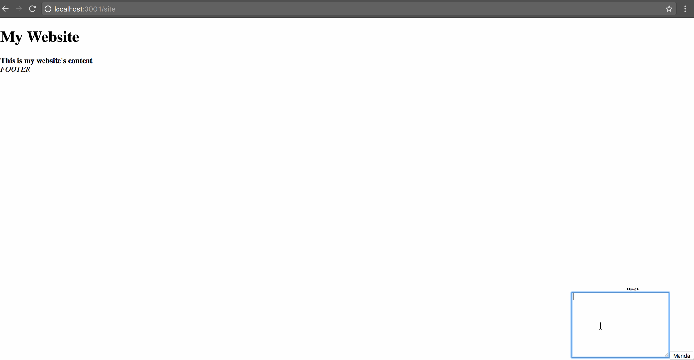

# Live chat example

#### Installation

  $ yarn
  $ cp .env.example .env (add your pusher credentials)
  $ cd client && yarn

#### To test it:

 - http://localhost:3001/site
 - http://localhost:3001/sender
 - http://localhost:3001/listener
 
#### Techs:

  - react (create-react-app)
  - express
  - pusher

### Example

